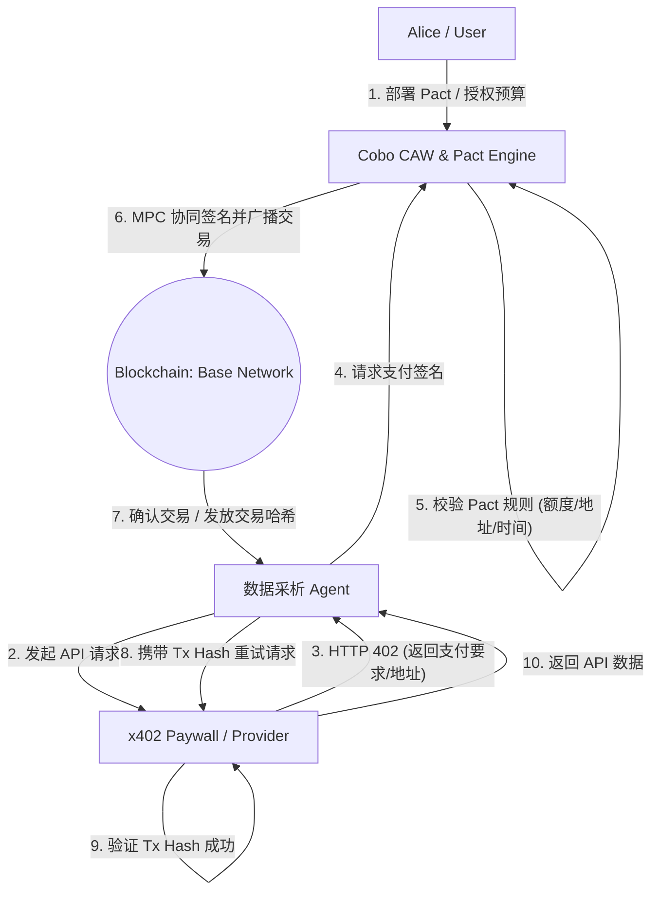

# Week 2 Module B — Cobo CAW + x402 Autopay Closed-Loop Design

**作者**：beetroot42  
**日期**：2026-05-29  
**来源**：[AI × Web3 School Handbook](https://aiweb3.school/zh/handbook/)  
**仓库**：https://github.com/beetroot42/ai-web3-school-cohort-0

---

## 1. 业务场景与架构设计

### 场景描述
> 用户 Alice 授权其 **"数据采析 Agent"** 每天去获取某付费链上分析平台 (DappRadar Pro) 的 API 数据。
> 该 API 受到 **x402 Paywall** 保护，单次请求收费 0.5 USDC。
> 为防止 Agent 陷入死循环或恶意超支，Alice 使用 **Cobo CAW (Cobo Agentic Wallet)** 部署了一个 **Pact 协议**。
> 该 Pact 规定：限制该 Agent 的每日预算为 5 USDC，限调用 DappRadar 合约/收款地址，限期 7 天，超时或超支自动终止。

### 架构图 


---

## 2. Pact 协议定义 

Alice 为 Agent 创建的 **Pact (Human-Agent Authorization Contract)** 定义如下。该配置在 Cobo 协同签名节点与智能合约层面共同校验。

```yaml
pact:
  id: "pact-dd-data-20260529"
  version: "1.0.0"
  intent: "Daily fetch of DappRadar Pro analytical API data"
  creator: "0xAliceSmartAccountAddress..."
  agent: "0xAgentEnclaveOrPublicAddress..."
  wallet:
    mpc_threshold: "2-of-3"  # User Share, Agent Share, Cobo Share
  policies:
    # 限制链与代币
    allowed_assets:
      - chain_id: 8453  # Base Chain
        token_address: "0x833589fCD6Edb6E08f4c7C32D4f71b54bda02913"  # USDC on Base
    # 限制交互的收款地址 (DappRadar Paywall 接收端)
    allowed_recipients:
      - "0xDappRadarPaywallRecipientAddress..."
    # 预算控制
    budget_control:
      limit_per_tx: "0.5 USDC"
      limit_per_day: "5.0 USDC"
      limit_total: "35.0 USDC"
    # 时间窗口
    time_window:
      start_time: 1780041600  # 2026-05-29T16:00:00+09:00
      end_time: 1780646400    # 7天后 (2026-06-05)
  termination_conditions:
    - on_budget_exceeded: "REJECT_AND_REVOKE"
    - on_expired: "REVOKE_SIGNING_RIGHTS"
```

---

## 3. x402 API 服务端设计 

服务商部署的 Express 风格中间件。用于识别未付款请求，返回 `HTTP 402` 并指引支付；在收到支付证明后放行请求。

```javascript
// x402-paywall-middleware.js
const { ethers } = require("ethers");

const PAYWALL_CONFIG = {
  price: "0.5", // USDC
  recipient: "0xDappRadarPaywallRecipientAddress...",
  tokenAddress: "0x833589fCD6Edb6E08f4c7C32D4f71b54bda02913", // Base USDC
  chainId: 8453
};

async function x402Paywall(req, res, next) {
  // 1. 检查请求头中是否包含 Payment Proof
  const paymentProof = req.headers["x-payment-proof"];
  
  if (!paymentProof) {
    // 未检测到支付凭证，返回 HTTP 402 Payment Required
    res.setHeader("x402-payment-required", `amount=${PAYWALL_CONFIG.price}, token=${PAYWALL_CONFIG.tokenAddress}, chain=${PAYWALL_CONFIG.chainId}, recipient=${PAYWALL_CONFIG.recipient}`);
    return res.status(402).json({
      error: "Payment Required",
      message: "This endpoint requires an x402 payment of 0.5 USDC to access.",
      payment_instructions: {
        amount: PAYWALL_CONFIG.price,
        token: PAYWALL_CONFIG.tokenAddress,
        recipient: PAYWALL_CONFIG.recipient,
        chain_id: PAYWALL_CONFIG.chainId
      }
    });
  }

  // 2. 解析并验证支付凭证 (Tx Hash)
  try {
    const txHash = paymentProof;
    const provider = new ethers.JsonRpcProvider("https://mainnet.base.org");
    const tx = await provider.getTransaction(txHash);
    
    if (!tx) {
      return res.status(400).json({ error: "Invalid payment proof: Transaction not found." });
    }

    // 验证交易状态、收款人、金额、代币合约
    const receipt = await provider.getTransactionReceipt(txHash);
    if (!receipt || receipt.status !== 1) {
      return res.status(400).json({ error: "Invalid payment proof: Transaction failed." });
    }

    // 解析 ERC-20 Transfer log 
    const isVerified = verifyERC20Transfer(tx, receipt, PAYWALL_CONFIG);
    if (!isVerified) {
      return res.status(402).json({ error: "Verification failed: Incorrect recipient, amount or token." });
    }

    // 3. 验证通过，允许访问数据
    next();
  } catch (error) {
    return res.status(500).json({ error: "Internal validation error", details: error.message });
  }
}

function verifyERC20Transfer(tx, receipt, config) {
  // 极简实现：实际需解析 Transfer(address from, address to, uint256 value) 事件 log
  const transferLog = receipt.logs.find(log => log.address.toLowerCase() === config.tokenAddress.toLowerCase());
  if (!transferLog) return false;

  const interface = new ethers.Interface(["event Transfer(address indexed from, address indexed to, uint256 value)"]);
  const parsedLog = interface.parseLog(transferLog);
  
  const toCorrectRecipient = parsedLog.args.to.toLowerCase() === config.recipient.toLowerCase();
  const correctAmount = ethers.formatUnits(parsedLog.args.value, 6) === config.price; // USDC uses 6 decimals
  
  return toCorrectRecipient && correctAmount;
}

module.exports = x402Paywall;
```

---

## 4. Agent 消费方自主支付逻辑

Agent 运行的主逻辑。包含**检测 402**、**请求 CAW 签名**、**获取凭证并成功调用**的全流程。

```python
# agent_autopay_client.py
import requests
import time
from web3 import Web3

BASE_USDC_CONTRACT = "0x833589fCD6Edb6E08f4c7C32D4f71b54bda02913"
API_URL = "https://api.dappradar-pro.com/v1/analytics"

class AgentAutopayClient:
    def __init__(self, caw_client):
        self.caw = caw_client  # Cobo CAW Client SDK 用于请求协同签名
        self.w3 = Web3(Web3.HTTPProvider("https://mainnet.base.org"))

    def fetch_data(self):
        # 1. 尝试无凭证请求 API
        print("[Agent] Attempting to fetch API data...")
        response = requests.get(API_URL)
        
        # 2. 识别付款要求 (HTTP 402)
        if response.status_code == 402:
            print("[Agent] Received HTTP 402: Payment Required.")
            pay_instructions = response.json().get("payment_instructions")
            
            if not pay_instructions:
                print("[Agent] Error: No payment instructions provided in headers/body.")
                return None
                
            # 3. 准备向 Cobo CAW 发送支付交易请求
            print(f"[Agent] Preparing to pay {pay_instructions['amount']} USDC to {pay_instructions['recipient']}...")
            
            # 构造代币转账 Data (ERC-20 transfer)
            recipient = Web3.to_checksum_address(pay_instructions['recipient'])
            amount_raw = int(float(pay_instructions['amount']) * 1e6) # USDC 6 decimals
            
            usdc_abi = [{"constant": False, "inputs": [{"name": "_to", "type": "address"}, {"name": "_value", "type": "uint256"}], "name": "transfer", "outputs": [{"name": "", "type": "bool"}], "type": "function"}]
            usdc_contract = self.w3.eth.contract(address=Web3.to_checksum_address(BASE_USDC_CONTRACT), abi=usdc_abi)
            
            tx_data = usdc_contract.functions.transfer(recipient, amount_raw).build_transaction({
                'from': self.caw.wallet_address,
                'gas': 100000,
                'gasPrice': self.w3.eth.gas_price,
                'nonce': self.w3.eth.get_transaction_count(self.caw.wallet_address),
                'chainId': 8453
            })
            
            # 4. 请求 Cobo CAW 对交易进行 Pact 政策检查与 MPC 协同签名
            print("[Agent] Requesting signature from Cobo CAW under Pact limits...")
            signed_tx = self.caw.sign_transaction(tx_data, pact_id="pact-dd-data-20260529")
            
            if not signed_tx:
                print("[Agent] Payment rejected by Cobo CAW. Pact policy violation (e.g. Budget Exceeded).")
                return None
                
            # 5. 广播交易并等待区块打包
            print("[Agent] Broadcaster signing transaction to Base Network...")
            tx_hash = self.w3.eth.send_raw_transaction(signed_tx.rawTransaction)
            print(f"[Agent] Payment transaction broadcasted. Tx Hash: {tx_hash.hex()}")
            
            # 等待打包确认
            self.w3.eth.wait_for_transaction_receipt(tx_hash)
            print("[Agent] Payment confirmed on-chain!")
            
            # 6. 携带 Tx Hash 重试请求
            headers = {
                "x-payment-proof": tx_hash.hex()
            }
            print("[Agent] Retrying API request with payment proof...")
            final_response = requests.get(API_URL, headers=headers)
            
            if final_response.status_code == 200:
                print("[Agent] Success! Retrieved data.")
                return final_response.json()
            else:
                print(f"[Agent] Failed to retrieve data even after payment. Error: {final_response.text}")
                return None
        elif response.status_code == 200:
            print("[Agent] Accessed resource directly without paywall.")
            return response.json()
        else:
            print(f"[Agent] Request failed with status code {response.status_code}")
            return None
```

---

## 5. 风险边界与安全防御设计 (Risk Mitigation)

AI Agent 自动操纵资产是把双刃剑，必须在架构设计层面做出明确防御。

### 风险 1: 恶性循环攻击 (Infinite loop / Spend exploit)
*   **威胁**: Agent 代码出现 bug（如未正确解析 API 返回结果，或 API 不断返回 402），导致 Agent 连续不断支付 API 费用。
*   **防御**: **Pact 协议层拦截**。Cobo CAW 节点的协同签名算法是**完全无状态隔离于 Agent 逻辑运行的**。每次签名请求到达时，Cobo 的 Pact Engine 会读取当前链上历史记录：
    - 是否超出了 `limit_per_day: 5 USDC` 的额度。
    - 在 1 分钟内是否发起了超过 2 次签名请求。
    - 一旦超出，Pact 引擎立即**拒绝生成 MPC 签名**，Agent 本地逻辑如何重试都无济于事。

### 风险 2: 目标收款地址篡改 (Prompt Injection / MITM)
*   **威胁**: DappRadar Server 遭到黑客攻击，或者 Agent 遭遇 Prompt 注入，黑客修改了返回 402 指导信息中的 `recipient` 地址，诱导 Agent 将钱付往黑客钱包。
*   **防御**: **白名单约束 (Recipient Constraint)**。
    - Pact 中硬编码 `allowed_recipients: ["0xDappRadarPaywallRecipientAddress..."]`。
    - 协同签名系统在构造并签署 ERC-20 `transfer(to, value)` 交易前，会解码交易的 `calldata`。如果发现 `to` 字段不属于白名单列表，立即中止交易签名。

### 风险 3: gas 费异常耗尽钱包
*   **威胁**: Base 网络短时间发生剧烈拥堵，导致 gas 费暴涨。Agent 为发送 0.5 USDC 的数据请求，付出了 5 USDC 的 gas 费。
*   **防御**: **CAW 侧设置交易策略 (Gas Limit Policy)**。
    - 规定单次交易的 `maxPriorityFeePerGas` 和 `maxFeePerGas` 绝对限制。
    - 如果当前网络 gas 费估算超过设定值，Cobo 协同签名直接失败，迫使 Agent 自动延迟任务或向用户 Smart Account 发送预警通知。

### 风险 4: 可审计记录丢失
*   **威胁**: 发生资金转移后，事后无法对账，不知道 Agent 买的是哪一次的什么数据。
*   **防御**: **链上 Event 溯源**。
    - 每一笔付款都对应唯一的 `tx_hash`，其中打包了 transaction inputs (对应 DappRadar 产生的 task_id/quote_id 哈希)。
    - DappRadar 必须在交付时返回一份由服务器私钥签名的 Receipt 并在 IPFS 存档。


