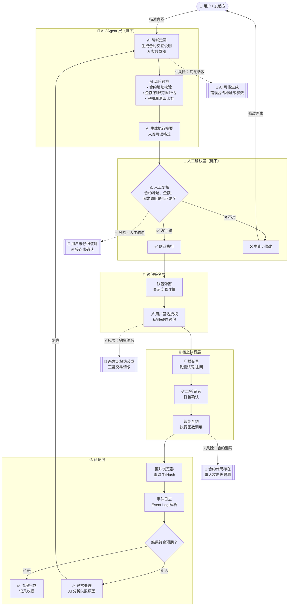

# 任务 04 — 最小 AI × Web3 工作流

> **工作流主题**：AI Agent 辅助合约交互 → 人工复核 → 链上执行 → 验证

---

## 流程图（Mermaid）

---

## 图例说明

| 符号 | 含义 |
|------|------|
| 👤 | 用户（任务发起方）|
| 🤖 | AI / Agent 自动执行 |
| 🧑 | **必须人工确认** |
| 🔐 | 钱包签名 / 授权 |
| ⛓️ | 链上执行（不可逆）|
| 🔍 | 结果验证 |
| 🔴 | 风险点 |

---

## 各步骤详解

### 谁发起任务
**用户**以自然语言描述意图（例如："向 0xABC... 转 0.01 ETH"或"调用 mint() 函数"）。

### 谁执行
| 步骤 | 执行方 |
|------|--------|
| 解析意图、生成参数 | 🤖 AI Agent |
| 风险预检 | 🤖 AI Agent |
| 生成人类可读摘要 | 🤖 AI Agent |
| **复核摘要内容** | **🧑 必须人工** |
| 钱包签名 | **🧑 必须人工（钱包）** |
| 广播 & 执行 | ⛓️ 链上自动 |
| 查询 TxHash | 🤖 AI 辅助 |
| **判断结果是否符合预期** | **🧑 人工最终确认** |

### 哪一步需要钱包签名 / 付款 / 授权
- **W2 钱包弹窗签名**：这是唯一不可绕过的人工授权点。任何链上操作必须经过私钥签名，AI 无法代替。

### 哪一步必须人工确认
1. **H1 人工复核**：核查合约地址、调用函数名、金额、Gas 上限
2. **W2 钱包签名**：在钱包界面再次核对并物理授权
3. **V3 结果判断**：最终验证链上状态是否符合预期

---

## 五句话总结

1. **这个流程解决什么问题**
   AI 擅长解析意图和生成参数，但不应直接控制链上资产。此工作流在 AI 生成阶段和链上执行之间插入强制人工确认点，明确划出"AI 辅助"与"人工授权"的边界，防止 AI 错误或恶意输出直接造成资产损失。

2. **哪些步骤由 AI / Agent 辅助**
   意图解析、合约参数生成、风险预检（合约地址校验、已知漏洞比对）、人类可读摘要生成、交易完成后的 TxHash 查询和事件日志解析——这些都属于 AI 的信息处理层，不涉及资产控制权。

3. **哪些步骤必须人工确认**
   两个不可绕过的关卡：① 执行前的**内容复核**（确认合约地址和参数正确）；② **钱包签名**（私钥只有用户本人持有，AI 物理上无法代签）。两者缺一不可，且顺序不能颠倒。

4. **如何验证最终结果**
   交易广播后，通过区块浏览器（如 Etherscan/Sepolia Explorer）查询 TxHash，确认交易状态为 `Success`，检查事件日志（Event Logs）中的参数是否与预期一致，必要时调用合约 `view` 函数查询状态变化。

5. **主要风险点是什么**
   ① **AI 幻觉**：模型可能生成错误的合约地址或函数参数；② **人工疏忽**：用户未仔细阅读摘要就点击确认；③ **钓鱼签名**：恶意网站伪装成正常交易弹窗诱导授权；④ **合约漏洞**：目标合约本身存在安全缺陷，AI 预检无法覆盖所有情况。

---

## 🔗 相关资源

- Sepolia 测试网浏览器: https://sepolia.etherscan.io/
- 上一篇笔记: [03-account-types-comparison.md](./03-account-types-comparison.md)
