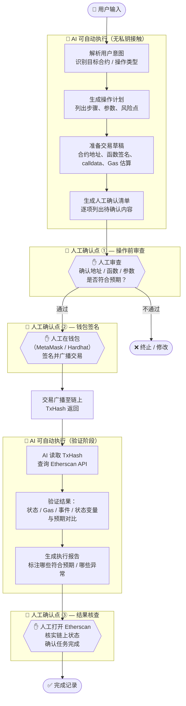

# Task 08 — 受限 Web3 操作助手设计文档

> beetroot42 · AI × Web3 School · 2026-05-27

---

## 1. 要解决什么问题

**场景**：用户想要在以太坊测试网（或主网）上**部署合约 / 调用写函数 / 发起转账**，但：

- 不确定操作步骤是否正确（Gas 参数？函数签名？地址格式？）
- 不确定操作后链上结果是否符合预期
- 担心在 AI 辅助过程中暴露私钥或助记词

**目标**：设计一个 AI 助手，能规划、解释、生成草稿、检查结果，但**所有涉及签名、授权、链上写入的步骤，都必须人工确认，AI 不能自动执行**。

具体 PoC 场景：**以 SimpleCounter 合约的 `increment()` 调用为例**，完整走一遍"AI 辅助 + 人工执行"的链上操作流程。

---

## 2. Workflow 全图



---

## 3. 各步骤详解

### 步骤 A — AI 解析意图

**输入**（用户自然语言）：
```
我想在 Sepolia 上调用 SimpleCounter 合约的 increment() 函数，
合约地址是 0x1234...abcd
```

**AI 输出**：
```
识别结果：
- 网络：Sepolia Testnet（Chain ID: 11155111）
- 操作类型：写函数调用（需要 Gas，需要签名）
- 合约地址：0x1234...abcd
- 目标函数：increment()
- 函数选择器：0xd09de08a
- 参数：无
- 预计 Gas：~25,000（建议上限设为 50,000）
```

---

### 步骤 B — AI 生成操作计划

**AI 输出**（操作计划 Markdown）：

```markdown
## 操作计划：调用 increment()

1. 确认钱包地址有足够 Sepolia ETH（≥ 0.001 ETH）
2. 确认合约地址已在 Etherscan 上验证
3. 准备调用参数（本次为空）
4. 在 MetaMask / Hardhat 中发起交易
5. 等待交易确认（约 12-15 秒）
6. 在 Etherscan 上验证 count 已从 N 变为 N+1
7. 验证 Incremented 事件已 emit

⚠️ 风险提示：
- increment() 是 external，任何地址均可调用，不需要 owner 权限
- 调用成功后 count 不可撤销，只有 owner 才能 reset
- 如果 Gas 不足，交易会 revert 并消耗已用 Gas
```

---

### 步骤 C — AI 生成交易草稿

**AI 输出**（供人工填入钱包或 Hardhat 脚本）：

```javascript
// 可直接粘贴到 Hardhat console 或 scripts/
const contract = await ethers.getContractAt(
  "SimpleCounter",
  "0x1234...abcd"   // ← 请人工核对此地址
);

// ⚠️ 以下步骤需要人工在钱包确认签名
const tx = await contract.increment();
console.log("TxHash:", tx.hash);
await tx.wait();
console.log("✅ Done");
```

**或 MetaMask 手动调用参数：**
```
To:       0x1234...abcd
Value:    0 ETH
Data:     0xd09de08a   （increment() 的函数选择器）
Gas Limit: 50000
```

---

### 🔐 人工确认点 ① — 操作前清单

AI 生成，人工逐项勾选：

```
□ 合约地址已在 Etherscan 上核实（非仿冒合约）
□ 目标函数名称正确：increment()
□ 调用参数为空（本次无参数）
□ 发送钱包地址是预期的账户（非高价值主网账户）
□ 当前在 Sepolia 网络（非主网）
□ 钱包余额足够支付 Gas
□ 理解此操作不可撤销
```

**只有全部勾选后，用户才进行下一步。AI 不自动跳过此清单。**

---

### 🔐 人工确认点 ② — 钱包签名

AI **完全不参与**此步骤。私钥 / 助记词仅存在于：
- 用户的 MetaMask 钱包
- 用户本地的 `.env` 文件（不上传 Git）
- Hardhat 的本地 keystore

AI 只能看到：签名后返回的 `TxHash`。

---

### 步骤 E-G — AI 验证执行结果

**AI 输入**：`TxHash = 0xabcd...1234`

**AI 调用 Etherscan API**（公开，无需私钥）：
```
GET https://api-sepolia.etherscan.io/api
  ?module=transaction
  &action=gettxreceiptstatus
  &txhash=0xabcd...1234
  &apikey={ETHERSCAN_KEY}
```

**AI 输出报告**：
```markdown
## 执行验证报告

- TxHash: 0xabcd...1234
- 状态: ✅ Success（status: 1）
- Block: #6,234,891
- Gas Used: 26,422 / 50,000
- 链接: https://sepolia.etherscan.io/tx/0xabcd...1234

事件检查：
- ✅ Incremented(caller=0xYourAddr, newCount=2) 已 emit

状态变量检查（读合约）：
- 调用前 count: 1
- 调用后 count: 2  ← ✅ 符合预期（+1）
```

---

### 🔐 人工确认点 ③ — 最终核查

```
□ 打开 Etherscan 链接，手动确认 Status: Success
□ 点击 Logs，查看 Incremented 事件是否存在
□ 读取合约的 count() 函数，确认当前值
□ 如有异常，记录 TxHash 供后续排查
```

---

## 4. 输入 / 输出示例汇总

| 步骤 | 输入 | 输出 | 执行者 |
|------|------|------|--------|
| 意图解析 | 自然语言描述 | 结构化操作参数 | 🤖 AI |
| 操作计划 | 结构化参数 | Markdown 步骤 + 风险提示 | 🤖 AI |
| 交易草稿 | ABI + 地址 + 函数 | Hardhat 脚本 / calldata | 🤖 AI |
| 确认清单 | 操作草稿 | Checkbox 清单 | 🤖 AI 生成 / 👤 人工执行 |
| **签名广播** | **私钥 + 交易数据** | **TxHash** | **👤 人工（钱包）** |
| 结果验证 | TxHash | 执行报告 | 🤖 AI（Etherscan API）|
| **最终确认** | **Etherscan 链接** | **人工核查** | **👤 人工** |

---

## 5. 风险与限制

### ⚠️ 风险

| # | 风险 | 说明 | 缓解措施 |
|---|------|------|----------|
| 1 | **AI 生成错误地址** | AI 可能把合约地址记错或格式错误，导致资金发送到错误地址 | 人工确认清单强制核对地址；用 Etherscan 验证合约存在性 |
| 2 | **Gas 估算偏低** | 链上拥堵或合约逻辑变化可能导致实际 Gas 超过 AI 估算，交易 revert | AI 估算加 2x buffer；用户手动设置 Gas limit |
| 3 | **前端签名钓鱼** | 如果 AI 助手被嵌入恶意前端，calldata 可能被篡改（显示 A，实际签 B） | 钱包显示 hex data 时人工核对函数选择器；使用 Hardhat 而非第三方前端 |
| 4 | **主网 / 测试网混淆** | AI 生成的脚本用于 Sepolia，但用户钱包切换到了主网 | 人工确认清单必须包含网络 ID 核查；AI 在草稿中明确标注 Chain ID |
| 5 | **Etherscan API 延迟** | 交易广播后 Etherscan 可能有 30-60 秒同步延迟，导致 AI 验证报告误判失败 | AI 在报告中标注"如 10 分钟后仍未确认，请联系支持"；人工再次核查 |

### 🚫 AI 被明确禁止的操作

```
✗ 读取 .env 文件中的 PRIVATE_KEY 或 MNEMONIC
✗ 自动调用 ethers.sendTransaction() 而不等待人工确认
✗ 存储、传输或打印任何私钥相关字符串
✗ 绕过人工确认清单直接执行下一步
✗ 在未经用户授权的情况下发起 Etherscan 以外的外部 API 调用
```

---

## 6. 如何验证执行结果

### 链上验证（三重核查）

```bash
# 1. 用 Etherscan 直接读 count()
# 打开：https://sepolia.etherscan.io/address/0x1234...abcd#readContract
# → count() 应返回期望值

# 2. 用 Hardhat console 读链上状态（只读，无需签名）
npx hardhat console --network sepolia
> const c = await ethers.getContractAt("SimpleCounter", "0x1234...abcd")
> (await c.count()).toString()   // 应为 "2"

# 3. 检查事件 log
# Etherscan → Tx → Logs → 确认 Incremented 事件存在
```

### 结果判定标准

| 检查项 | 通过条件 |
|--------|----------|
| Tx Status | `Success`（非 `Failed` / `Pending`） |
| Gas Used | 在估算范围内（< Gas Limit 的 80%）|
| count 变化 | 调用后 = 调用前 + 1 |
| 事件 Emit | `Incremented(caller, newCount)` 存在于 Logs |
| 无意外 ETH 转移 | Tx Value = 0 ETH |

---

## 7. 边界定义（一句话版本）

> **AI 是地图，不是司机。**  
> AI 可以告诉你该走哪条路、预判风险、检查你是否到达了目的地，  
> 但驾驶方向盘（私钥签名）永远在你手里。

---

## 来源与工具参考

- Etherscan API 文档：https://docs.etherscan.io/api-endpoints/transactions
- Hardhat 文档：https://hardhat.org/docs
- MetaMask 手动 calldata 签名：https://metamask.io/learn
- SimpleCounter 合约（Task 05）：`d:\AI × Web3 School\tasks\05-contract-deploy\SimpleCounter.sol`
